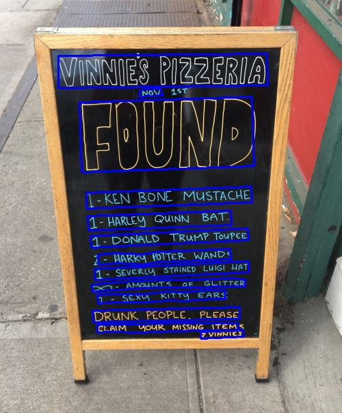

# CRAFT-text-detection

An unofficial PyTorch implementation of CRAFT text detector with better interface and fp16 support

> This is not official implementation. I partially use code from the [original repository](https://github.com/clovaai/CRAFT-pytorch)

Main features of this implementation:
- User-friendly interface 
- Easier to integrate this model in your project
- fp16 inference support
- Automatically downloading weights from [huggingface](https://huggingface.co/boomb0om/CRAFT-text-detector/tree/main)

## Installation

```bash
git clone https://github.com/boomb0om/CRAFT-text-detection
cd CRAFT-text-detection/
pip install -r requirements.txt
```

To test model you can run `test.py` file.

## Examples

```python
from PIL import Image
from CRAFT import CRAFTModel, draw_polygons

model = CRAFTModel('weights/', 'cuda', use_refiner=True, fp16=True)
img = Image.open('images/cafe_sign.jpg')
polygons = model.get_polygons(img)
result = draw_polygons(img, polygons)
```

You can find more usage examples in [example.ipynb](example.ipynb)


Detected polygons:


